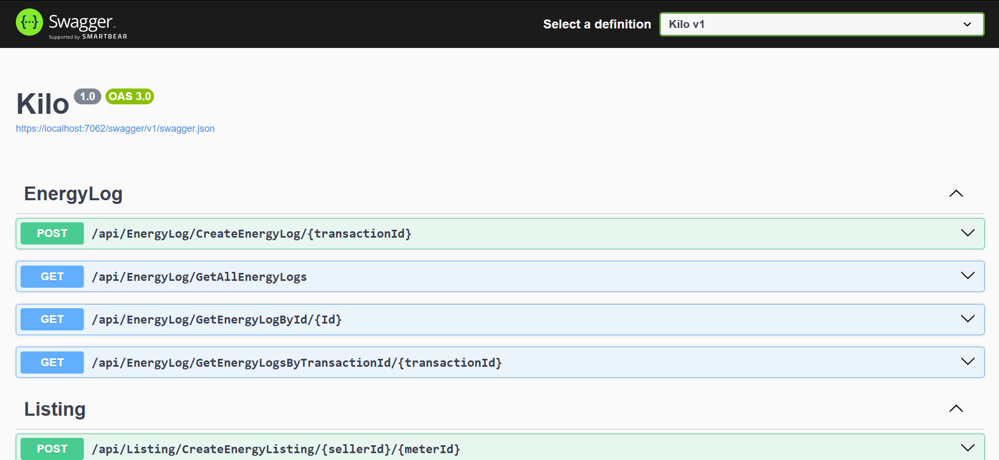
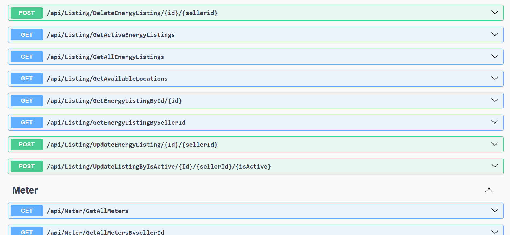
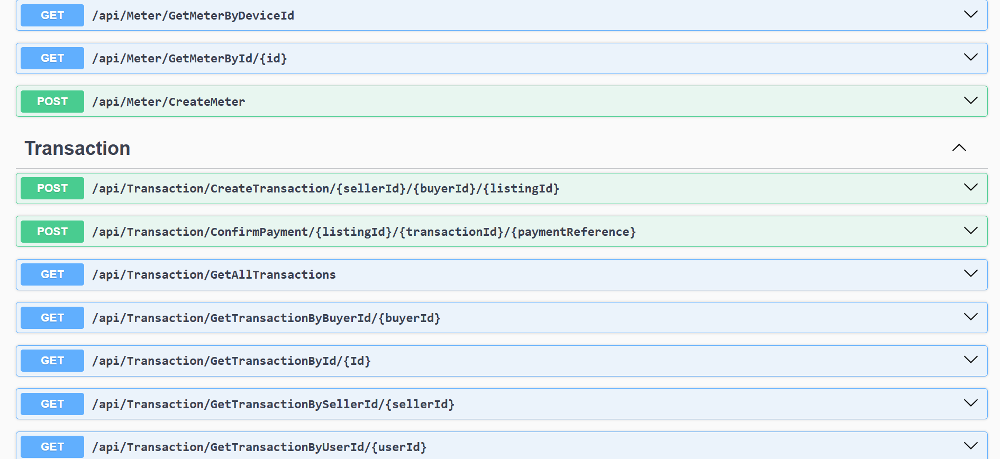
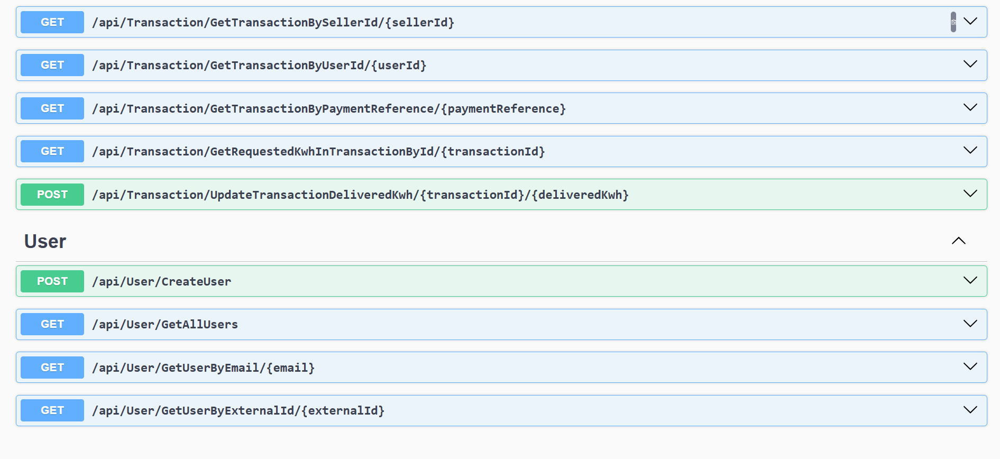

# ⚡ Kilo Backend API

[](https://dotnet.microsoft.com/)
[](https://opensource.org/licenses/MIT)
[](https://azure.microsoft.com/)

**Kilo** is a high-performance backend API built with **ASP.NET Core** that facilitates a decentralized energy marketplace. It enables users to buy and sell surplus solar/wind energy (kWh) through automated listing management and real-time transaction tracking.

---

## 🚀 Features

- **Energy Marketplace:** Create, manage, and discover energy listings based on location.
- **Transaction Engine:** Secure lifecycle management for buying/selling energy.
- **Real-Time Tracking:** Dynamic kWh tracking and automated delivery processing.
- **Meter Integration:** Tracks total generation vs. consumption to calculate available surplus.
- **Background Workers:** Hosted services manage energy delivery asynchronously.
- **Enterprise Logging:** Robust error tracking and system health monitoring via **NLog**.

---

## 🏗️ Tech Stack

* **Framework:** ASP.NET Core (.NET 8)
* **Database:** Azure SQL / SQL Server
* **ORM:** Entity Framework Core (Code First)
* **Deployment:** Azure App Service (Linux)
* **CI/CD:** GitHub Actions (Automated Deployment on Push)
* **API Documentation:** Swagger / OpenAPI
* **Security:** IP-based Rate Limiting, Forwarded Headers, and RowVersion Concurrency Control.

---

## 📂 Project Architecture

The project follows a clean, layered architecture for maintainability and scalability:

├── Data/           # DbContext and Migrations
├── Controllers/    # API Endpoints
├── Services/       # Business Logic Layer
├── Repository/     # Data Access Layer
├── Models/         # Database Entities
├── DTOs/           # Data Transfer Objects
├── Mappers/        # AutoMapper / Manual Mapping
└── Helpers/        # Utilities & Middleware (Rate Limiting, IP Forwarding)

-----

## 🔐 Security & Optimization

  - **Rate Limiting:** Sliding window policy per User IP to prevent API abuse.
  - **Azure Ready:** Pre-configured with `ForwardedHeaders` to correctly identify client IPs behind Azure's reverse proxy.
  - **Environment Safety:** Uses `.env` for local development and Azure Environment Variables for production secrets.
  - **Concurrency:** Implements `RowVersion` to prevent "Double Spend" scenarios in energy transactions.

-----

## 🧪 API Documentation

The API is fully documented with Swagger. Once running, you can explore the endpoints at `/swagger`.

### 📸 Preview

\<details\>
\<summary\>View Swagger Screenshots\</summary\>
<br>
\
\
\
\
\</details\>

-----

## 🔄 CI/CD Pipeline

This project uses **GitHub Actions** for continuous integration and deployment. Every push to the `main` branch triggers:

1.  **Build:** Restores dependencies and compiles the .NET project.
2.  **Publish:** Packages the application for production.
3.  **Deploy:** Automatically pushes the new build to **Azure App Service**.

-----

## 📌 Roadmap

  - [ ] **Identity:** Integrate JWT Authentication & Role-based access control.
  - [ ] **Payments:** Stripe/PayPal integration for actual financial settlement.
  - [ ] **Analytics:** Dashboard for users to visualize energy savings and earnings.
  - [ ] **Webhooks:** Real-time notifications for transaction updates.

-----

## 👨‍💻 Author

Developed by **[Young Jesse/GitHub Username: Otormin]** as part of the Kilo energy trading platform—an initiative to decentralize and democratize green energy exchange.

```